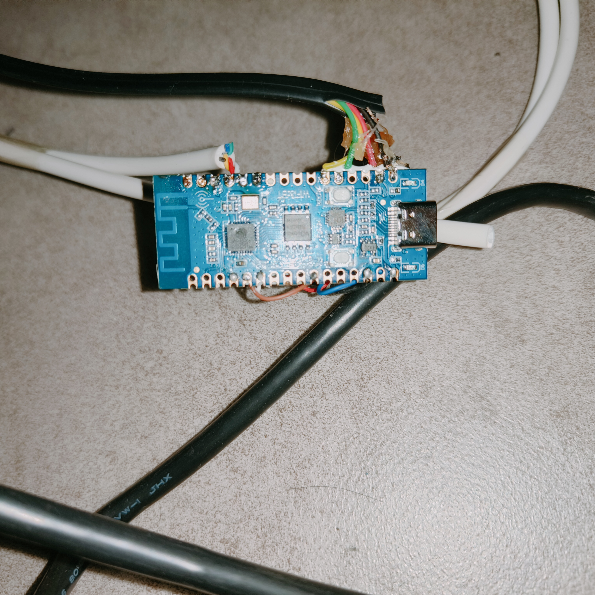
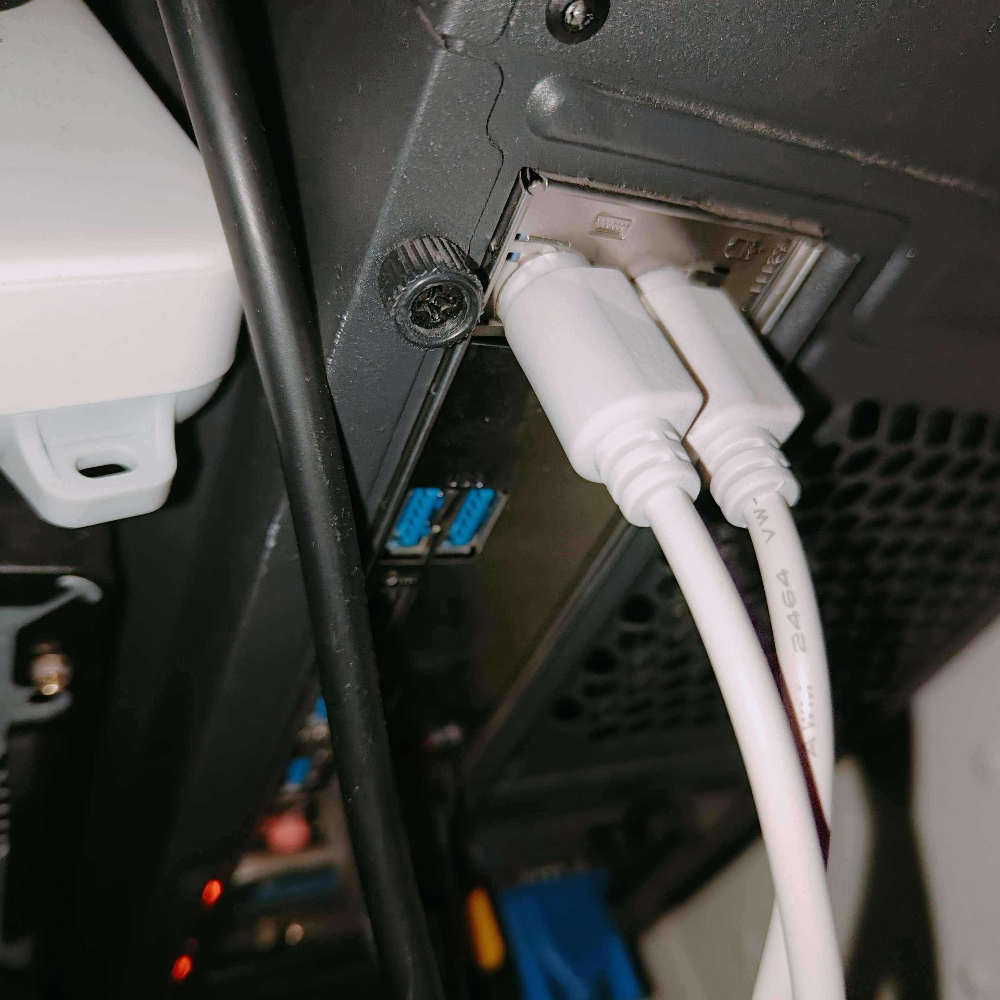
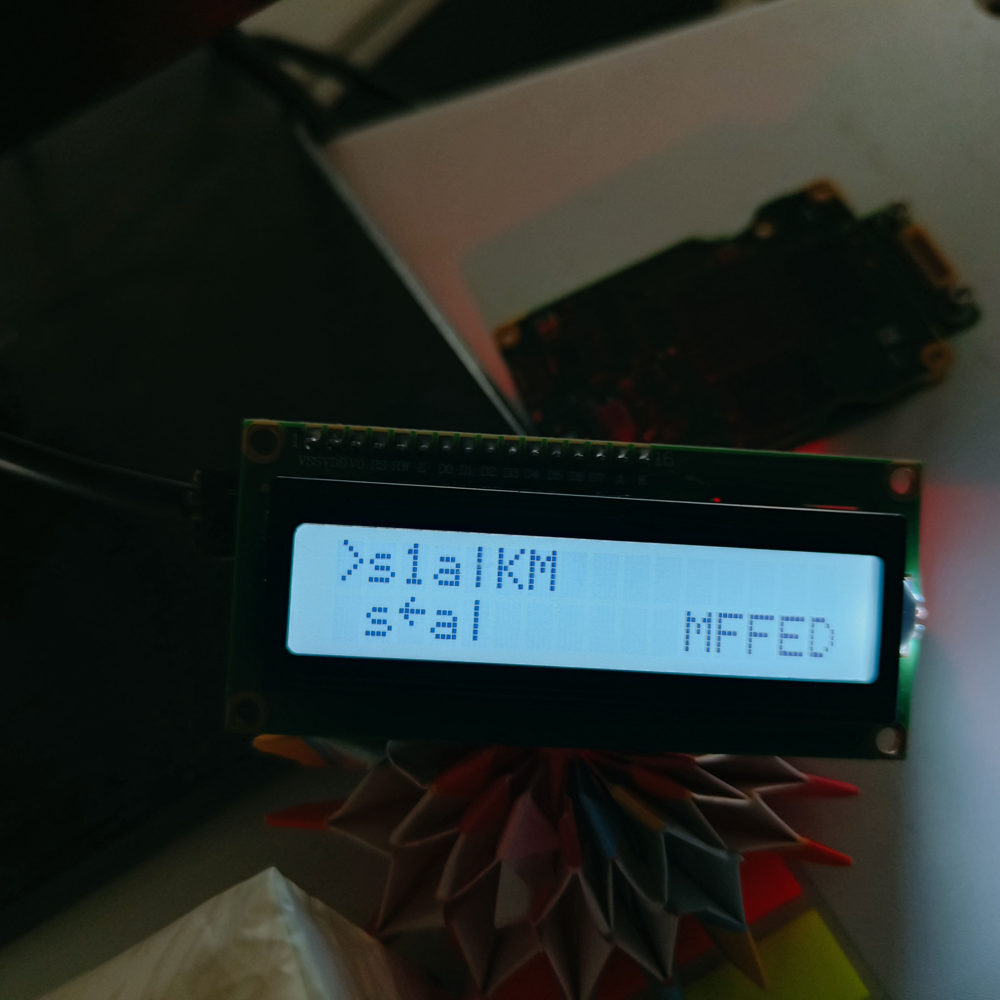

# ESP32C3 Bluetooth HID to PS2 Adapter

A converter based on ESP32C3 & ESP‑IDF V5.5.0.
It converts Bluetooth keyboard and mouse signals into standard PS2 protocol for two PCs.

## Features
- Bluetooth keyboard/mouse to 2× PS2 keyboard + 2× PS2 mouse
- 4 PS2 channels share one timer for efficiency
- I2C LCD1602 status display
- Bluetooth pairing code display, battery level, lock status

## Hardware Pinout

### PS2 Ports
| Function    | GPIO | Description          |
|-------------|------|----------------------|
| Key1 CLK    | 19   | Keyboard for PC 1    |
| Key1 DAT    | 13   | Keyboard for PC 1    |
| Mouse1 CLK  | 12   | Mouse for PC 1       |
| Mouse1 DAT  | 18   | Mouse for PC 1       |
| Key2 CLK    | 2    | Keyboard for PC 2    |
| Key2 DAT    | 3    | Keyboard for PC 2    |
| Mouse2 CLK  | 10   | Mouse for PC 2       |
| Mouse2 DAT  | 6    | Mouse for PC 2       |

### LCD1602 I2C
| Pin  | GPIO | Description   |
|------|------|---------------|
| SCL  | 5    | I2C Clock     |
| SDA  | 4    | I2C Data      |

## LCD Display Format
Line 1: PC1 status  
Line 2: PC2 status

### Position Definition
| Position | Character/Value | Description                                      |
|----------|-----------------|--------------------------------------------------|
| 1        | `>` / None      | `>` = Active/Selected host                       |
| 2        | S / s           | S = Keyboard ready; s = Not ready/Error          |
| 3        | 1 / ←           | 1 = NumLock on; ← = NumLock off                  |
| 4        | A / a           | A = CapsLock on; a = CapsLock off                |
| 5        | - / \|          | - = ScrollLock on; \| = ScrollLock off           |
| 6        | K / k           | K = BT keyboard connected; k = Disconnected      |
| 7        | M / m           | M = BT mouse connected; m = Disconnected         |
| 8~13     | Pairing Code    | Bluetooth pairing code (lower priority than errors) |
| 12       | K/M + 4 Hex     | Unknown incoming command (K=Keyboard, M=Mouse)   |
| Line2 6~8 | Number          | Keyboard battery percentage (e.g., 100 = Full) work not well  |
| Line2 9~11| Number          | Mouse battery percentage (same format as keyboard) work not well|

## Development Environment
- ESP-IDF Version: 5.5.0
- Drivers from:
  - Reference/ps2 (tested, 4 PS2 channels share 1 timer)
  - Reference/lcd1602 (I2C, verified)

## Build & Flash
```bash
# Configure project (verify pins/parameters)
idf.py menuconfig
# Compile project
idf.py build
# Flash firmware (replace PORT with COM3 / /dev/ttyUSB0)
idf.py -p PORT flash
# View serial logs
idf.py -p PORT monitor
```
## Hardware example
-Prepare one or two PS2 Male Wire

-Prepare a ESP32 Develop Kit

-Weld the wires to the board as the tables

-Connect to PCS

-Turn on PC and watch the LCD and try to connect Keyboard, Mouse with BLE, and try to click them



